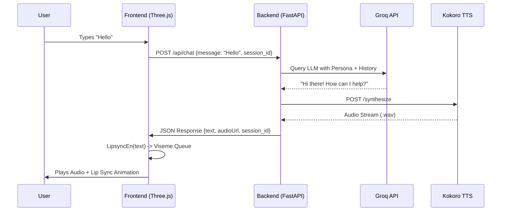
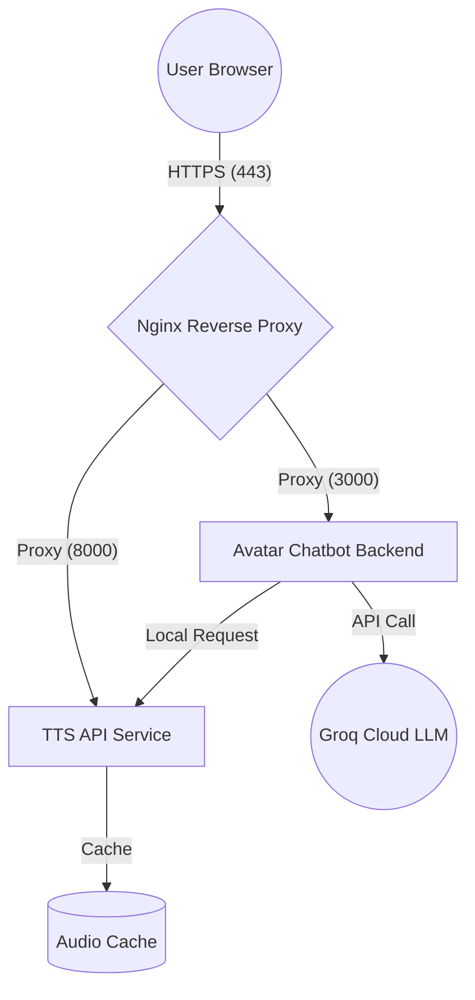

# AvatarConnect Technical Documentation v2.0

This manual provides a deep-dive into the AvatarConnect codebase for engineers maintaining or extending the system.

---

## 🏗️ Core Architecture & Data Flow

AvatarConnect is built on a modern AI-agent stack, separating high-frequency animation logic from high-latency AI reasoning.

### High-Level Flow
1. **Frontend:** Captures user input and state.
2. **Backend:** Authenticates via SQLite, fetches session history, and queries **Groq (Llama 3)**.
3. **Synthesis:** Backend sends AI response to **Kokoro TTS**, saves `.wav` to disk.
4. **Synchronization:** Frontend receives text and `audioUrl`. It uses `LipsyncEn` to generate a viseme timing map *while* fetching the audio stream.



---

## 🗄️ Persistence Layer (SQLite)

The database (`backend/database.db`) uses three relational tables to maintain persistent conversations.

### Table: `users`
| Column | Type | Description |
| :--- | :--- | :--- |
| `username` | TEXT (PK) | Unique identifier for the user. |
| `created_at`| TIMESTAMP | Automated join date. |

### Table: `sessions`
| Column | Type | Description |
| :--- | :--- | :--- |
| `id` | TEXT (PK) | UUID for the chat session. |
| `username` | TEXT (FK) | Links to `users.username`. |
| `title` | TEXT | First 30 chars of the first message. |

### Table: `messages`
| Column | Type | Description |
| :--- | :--- | :--- |
| `id` | INTEGER (PK)| Auto-incrementing ID. |
| `session_id`| TEXT (FK) | Links to `sessions.id`. |
| `role` | TEXT | 'user' or 'ai'. |
| `content` | TEXT | The actual message text. |

---

## 🧠 Backend Logic & AI Persona

### The AI Engine (`server.py`)
- **API:** Powered by `llama-3.3-70b-versatile` via Groq.
- **Context Handling:** Buffers the last 10 messages from the database for short-term memory.
- **Persona Enforcement:** Wrapped in a `# MISSION` and `# PERSONA` system prompt that includes Ontario Tech University crisis protocols (911/988 referrals).

### Text-to-Speech (TTS)
- Connects to a local Kokoro instance on `localhost:8000`.
- Implements an internal audio cache; if identical text is requested, it serves the existing file to reduce latency.

---

## 🎭 Frontend: Animation & Lip-Sync

The frontend is a Three.js application hosted in `AvatarAssistant` class.

### 1. The Lip-Sync Engine (`lipsync-en.js`)
Unlike simple volume-based jaw movement, AvatarConnect uses a **syllable-based viseme map**:
- **Tokenizer:** Splits text into syllables based on vowel patterns (Long/Short).
- **Viseme Mapper:** Maps specific phoneme clusters (e.g., 'PP', 'SS', 'TH') to [Ready Player Me Morph Targets](https://docs.readyplayer.me/ready-player-me/api-reference/rest-api/avatars/get-3d-avatars).
- **Timing:** Calculates duration per syllable, adjusting for "stressed" vs "unstressed" sounds.

### 2. The Animation Loop (`app.js`)
The `animate()` function runs at 60fps and manages concurrent states:
- **Idle State:** Subtle head sway (`sin` wave on Y/Z rotation) and random blinking (`updateBlink`).
- **Speaking State:** Real-time audio analysis via `AudioAnalyser`. It calculates RMS volume to scale the viseme influences, ensuring the mouth doesn't move during silence gaps in the middle of a speech.
- **Blinking Logic:** Uses `Math.random()` to trigger a blink every 2-7 seconds.

---

## 🔊 TTS Service Details (`avater-chatbot-tts`)

The TTS service is a standalone sibling project located in `avater-chatbot-tts/`. It provides high-quality speech synthesis with a focus on natural, female-led voices across multiple languages.

### Dual-Backend Architecture
- **Kokoro TTS:** Used for the majority of supported languages (English, Spanish, French, etc.). It delivers 82M parameter quality with high efficiency.
- **Piper TTS (via Sherpa-ONNX):** Primarily used for languages where Kokoro might lack coverage or specific models are preferred, such as **Persian (Farsi)** and **Min-nan (Taiwanese Hokkien)**.

### Key Logic & Features
1. **Automatic Language Detection:** Uses the `langdetect` library to identify the input language.
2. **Dynamic Voice Selection:** Automatically maps the detected language to a high-quality female voice preset (e.g., `af_bella` for English, `jf_alpha` for Japanese).
3. **Pipeline Caching:** The server caches model pipelines (`KPipeline`) to avoid the high latency of reloading weights on every request.
4. **Streaming:** Supports real-time audio chunking for long-form speech generation.

### API Endpoints (`api_server.py`)
- `POST /synthesize`: Primary endpoint for speech generation. Returns a `.wav` file.
- `POST /synthesize-stream`: Returns an audio stream for faster "time to first byte."
- `GET /voices`: Lists all 150+ available voice IDs and their characteristics.
- `POST /detect-language`: Returns the detected language code and recommended voice for a string of text.

---

## ⚙️ Configuration & Customization

### Environment Variables (`.env`)
- `GROQ_API_KEY`: Required for AI responses.
- `PORT`: Default is 3000.

### Adding New Avatars
Avatars are defined in `getAvatarUrl()` within `app.js`. To add a new one, include a mapping for the language code using a Ready Player Me GLB URL with these parameters for maximum quality:
`?morphTargets=ARKit,Oculus%20Visemes&lod=0&textureAtlas=none&quality=high`

### Modifying the Persona
Edit the `# SYSTEM PROMPT` section in `backend/server.py`. This prompt is injected into every chat request to ensure the AI never loses its "Student Companion" identity.

---

## 🚀 Production Deployment & Scaling

For a production-grade deployment, the system should be managed via `systemd` and served through a high-performance reverse proxy like **Nginx**.

### 1. Service Management (`systemd`)
The backend should be managed as a system service to ensure automatic restarts and logging. A reference service file is located at `packaging/avater-backend.service`.

**Installation:**
```bash
# 1. Copy the service file
sudo cp packaging/avater-backend.service /etc/systemd/system/

# 2. Reload daemon
sudo systemctl daemon-reload

# 3. Enable and Start
sudo systemctl enable avater-backend
sudo systemctl start avater-backend
```

**Key Directives:**
- `ExecStart`: Points to the virtual environment's Python to ensure dependency isolation.
- `Restart=always`: Ensures the server recovers from crashes.
- `WorkingDirectory`: Correctly sets the context for relative path resolution (SQL DB and Audio cache).

### 2. Reverse Proxy (`Nginx`)
Nginx is used to handle SSL termination, static file serving optimization, and request buffering.

**Example Configuration (`/etc/nginx/sites-available/avatarconnect`):**
```nginx
server {
    listen 80;
    server_name avatar.yourdomain.com;

    # Redirect HTTP to HTTPS
    return 301 https://$host$request_uri;
}

server {
    listen 443 ssl;
    server_name avatar.yourdomain.com;

    ssl_certificate /etc/letsencrypt/live/avatar.yourdomain.com/fullchain.pem;
    ssl_certificate_key /etc/letsencrypt/live/avatar.yourdomain.com/privkey.pem;

    # Frontend Static Assets
    location / {
        root /home/ubuntu/avatar/Avater-Chabot/frontend;
        index index.html;
        try_files $uri $uri/ /index.html;
    }

    # Backend API Proxy
    location /api/ {
        proxy_pass http://127.0.0.1:3000/api/;
        proxy_http_version 1.1;
        proxy_set_header Upgrade $http_upgrade;
        proxy_set_header Connection 'upgrade';
        proxy_set_header Host $host;
        proxy_cache_bypass $http_upgrade;
    }

    # Audio Cache Serving (Optimized)
    location /audio/ {
        alias /home/ubuntu/avatar/Avater-Chabot/audio/;
        expires 30d;
# Check status of all components
sudo systemctl status avatar-chatbot avatar-tts nginx

# Restart entire ecosystem
sudo systemctl restart avatar-chatbot avatar-tts nginx

# Individual component control
sudo systemctl [start|stop|restart] avatar-chatbot
```

### Log Monitoring
To debug issues in real-time, tail the journal logs:
- **Chatbot:** `sudo journalctl -u avatar-chatbot -f`
- **TTS:** `sudo journalctl -u avatar-tts -f`
- **Web Server:** `sudo tail -f /var/log/nginx/error.log`

---

## 🔐 11. Security Guardrails

1. **HTTPS Enforcement:** Nginx automatically redirects all port 80 (HTTP) traffic to port 443 (HTTPS).
2. **Reverse Proxy Masking:** Backend services (FastAPI) are NOT exposed directly to the internet; they only listen on `127.0.0.1`.
3. **Sensitive Key Management:** All API keys (Groq) are stored in the `backend/.env` file and are never hardcoded in the source logic.
4. **Service Isolation:** Each component runs in its own process with discrete logging and restart policies.

---

## 📊 12. Architecture Diagram (Traffic Flow)


---

## 🚀 13. Future Roadmap
- **Backups:** Implement automated daily snapshots of `database.db`.
- **Performance:** Optimize Nginx worker connections for high-concurrency event handling.
- **Monitoring:** Integrate Prometheus/Grafana for real-time CPU and latency tracking.
- **Concurrency:** The FastAPI backend uses `uvicorn`. For production, use `gunicorn` with worker class `uvicorn.workers.UvicornWorker` to manage multiple CPU cores efficiently.
- **Audio Cleanup:** In a high-traffic environment, implement a `cron` job to purge the `/audio` cache weekly to prevent disk exhaustion.
- **Database:** SQLite is sufficient for thousands of sessions, but if scaling to a global user base, consider migrating to PostgreSQL using SQLAlchemy.
